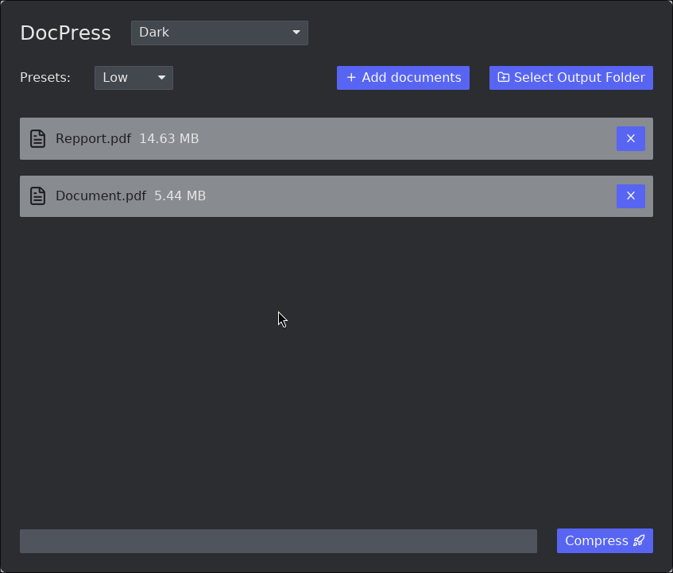

# DocPress

A minimalist GUI cross plateform to compress documents using Ghostscript in Rust with Iced v0.14.

Title: (no name really found from now)

    

### Warning

You must have ghostscript installed before compressing a file.

### About

This project is mainly build for my personnal use and to learn Rust (+Iced). 

---

### TODO

#### Code

 - [x] Split file and responsability into different one.
 - [x] Handling Ghostscript not found NOT Implemented (or any error status).
 - [x] Function splitting.
 - [ ] Improve the indexing logic on async work...
 - [ ] Write test for a more robust code.
 - [ ] Handling file rewrite :warning:.
 - [ ] Don't import twice documents + check if it's a file.
 - [ ] One file drag and drop (single file only maybe a batch also) mode (will be default)

#### UI 

 - [x] Ability to see the size of the document compressed.
 - [x] Add lucid icons.
 - [ ] Change UI scale.
 - [ ] Drag and drop features.
 - [ ] UI, Simply build a beautifull and rich UI.

---

    

